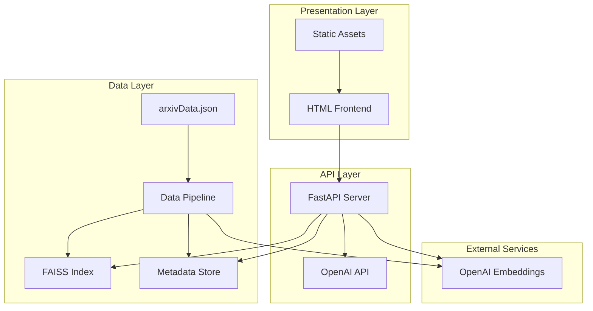

# Design Document: ArXiv Semantic Search System

## Overview

The ArXiv Semantic Search System is a full-stack intelligent search application that enables researchers to perform semantic queries over a large corpus of research papers. The system combines vector-based similarity search with LLM-powered synthesis to provide comprehensive, cross-document insights with proper citations.

The architecture follows a clean separation between data ingestion, retrieval, and reasoning components. The ingestion pipeline processes ArXiv papers into searchable embeddings, the FastAPI backend handles search requests through FAISS vector similarity, and an OpenAI LLM synthesizes coherent responses from retrieved context. A minimal HTML/JavaScript frontend provides the user interface.

Key design principles include simplicity (no heavy frameworks), scalability (supports 24K+ papers), and maintainability (clear component separation). The system is optimized for local development and demonstration while maintaining production-ready architecture patterns.

## Architecture

The system follows a three-tier architecture with clear separation of concerns:



**Data Flow:**
1. **Ingestion**: Raw ArXiv data → Chunking → Embedding → FAISS indexing
2. **Search**: User query → Query embedding → Vector similarity → Context retrieval
3. **Synthesis**: Retrieved context → LLM processing → Synthesized response with citations
4. **Presentation**: API response → Frontend rendering → User display

**Component Isolation:**
- **Data Pipeline** (`ingest.py`): Handles all data processing and index creation
- **Search API** (`app.py`): Manages search requests and LLM integration  
- **Frontend** (`templates/index.html`): Provides user interface without framework dependencies
- **External APIs**: OpenAI services for embeddings and chat completion

## Components and Interfaces

### Data Pipeline Component (`ingest.py`)

**Purpose**: Processes ArXiv research papers into a searchable vector index.

**Key Functions:**
- `load_arxiv_data(file_path, limit=None)`: Loads and optionally limits paper records
- `create_chunks(papers)`: Segments papers into ~800 character chunks with title+summary
- `generate_embeddings(chunks, model="text-embedding-ada-002")`: Creates normalized embeddings
- `build_faiss_index(embeddings)`: Constructs FAISS IndexFlatIP for cosine similarity
- `save_index_and_metadata(index, chunks, output_dir)`: Persists index.faiss and meta.json

**Interface:**
```python
# Command line interface
python ingest.py [--limit N] [--input arxivData.json] [--output ./data]

# Key data structures
Chunk = {
    "paper_id": str,
    "title": str, 
    "content": str,  # title + summary segment
    "chunk_index": int,
    "arxiv_url": str
}
```

**Technical Details:**
- Uses OpenAI `text-embedding-ada-002` (1536 dimensions) with sentence-transformers fallback
- Normalizes embeddings for cosine similarity via dot product in FAISS IndexFlatIP
- Maintains metadata alignment with vector positions for efficient retrieval
- Supports incremental processing with `--limit` for development/demo purposes

### Search API Component (`app.py`)

**Purpose**: Provides REST API for semantic search with LLM-powered response synthesis.

**Key Endpoints:**
- `POST /search`: Main search endpoint accepting query and top-k parameters
- `GET /`: Serves the frontend HTML interface
- `GET /static/{file}`: Serves static assets

**Core Functions:**
- `load_search_index()`: Initializes FAISS index and metadata at startup
- `embed_query(query)`: Generates query embedding using same model as ingestion
- `retrieve_similar_chunks(query_embedding, k)`: Performs vector similarity search
- `synthesize_response(chunks, query)`: Calls OpenAI ChatCompletion for answer generation
- `aggregate_papers(chunks)`: Groups chunks by paper for comprehensive coverage

**API Interface:**
```python
# Request format
POST /search
{
    "q": "natural language query",
    "k": 5  # number of top results
}

# Response format  
{
    "answer": "LLM synthesized response with citations",
    "hits": [
        {
            "paper_id": str,
            "title": str,
            "summary": str,
            "arxiv_url": str,
            "relevance_score": float
        }
    ],
    "query_time_ms": int
}
```

**LLM Integration:**
- Uses OpenAI `gpt-3.5-turbo` for response synthesis
- Implements structured prompting for cross-document reasoning and citation generation
- Handles API errors gracefully with fallback responses
- Maintains conversation context for coherent multi-document analysis

### Frontend Component (`templates/index.html`)

**Purpose**: Provides a clean, responsive web interface for search interaction.

**Key Elements:**
- Search textarea with placeholder guidance for complex queries
- Top-k selector (dropdown: 3, 5, 10, 15 results)
- Submit button with loading state management
- Results display area with synthesized answer and paper listings
- Error handling and user feedback mechanisms

**JavaScript Functions:**
- `submitSearch()`: Handles form submission and API communication
- `displayResults(data)`: Renders search results with proper formatting
- `showLoading()` / `hideLoading()`: Manages UI state during requests
- `formatPaperCard(paper)`: Creates individual paper result cards with arXiv links

**Interface Design:**
```html
<!-- Core search interface -->
<form id="searchForm">
    <textarea id="queryInput" placeholder="Enter semantic search query..."></textarea>
    <select id="topK">
        <option value="5">Top 5 Results</option>
        <!-- Additional options -->
    </select>
    <button type="submit">Search Papers</button>
</form>

<!-- Results display -->
<div id="results">
    <div id="synthesizedAnswer"></div>
    <div id="paperHits"></div>
</div>
```

**Styling Approach:**
- Minimal CSS without external frameworks
- Responsive design using CSS Grid and Flexbox
- Clean typography with proper contrast ratios
- Loading states and hover effects for better UX

## Data Models

### Paper Record
```python
@dataclass
class Paper:
    id: str                    # ArXiv paper identifier
    title: str                 # Paper title
    summary: str               # Abstract/summary text
    author: str                # Author names
    year: int                  # Publication year
    tags: List[str]            # Subject tags/categories
    arxiv_links: List[str]     # ArXiv URLs
```

### Text Chunk
```python
@dataclass  
class TextChunk:
    paper_id: str              # Reference to source paper
    title: str                 # Paper title (for context)
    content: str               # Chunked text (~800 chars)
    chunk_index: int           # Position within paper
    arxiv_url: str             # Direct link to paper
    embedding: Optional[np.ndarray] = None  # Vector representation
```

### Search Result
```python
@dataclass
class SearchHit:
    paper_id: str              # Paper identifier
    title: str                 # Paper title
    summary: str               # Paper abstract
    arxiv_url: str             # Link to ArXiv
    relevance_score: float     # Cosine similarity score
    matched_chunks: List[str]  # Relevant text segments
```

### API Models
```python
class SearchRequest(BaseModel):
    q: str                     # Search query
    k: int = 5                 # Number of results (default 5)

class SearchResponse(BaseModel):
    answer: str                # LLM synthesized response
    hits: List[SearchHit]      # Retrieved papers
    query_time_ms: int         # Response time
    total_chunks_searched: int # Index size context
```

### Index Metadata
```python
@dataclass
class IndexMetadata:
    chunks: List[TextChunk]    # Chunk metadata aligned with vectors
    index_size: int            # Total number of vectors
    embedding_model: str       # Model used for embeddings
    created_at: datetime       # Index creation timestamp
    paper_count: int           # Number of source papers
```

## Correctness Properties

*A property is a characteristic or behavior that should hold true across all valid executions of a system—essentially, a formal statement about what the system should do. Properties serve as the bridge between human-readable specifications and machine-verifiable correctness guarantees.*

Based on the prework analysis, the following properties ensure system correctness across all valid inputs and scenarios:

### Property 1: Data Extraction Consistency
*For any* valid ArXiv paper record, the data pipeline should extract exactly the title and summary fields without modification or loss
**Validates: Requirements 1.1**

### Property 2: Text Chunking Boundaries  
*For any* input text, all generated chunks should be approximately 800 characters with no chunk exceeding 1000 characters or being shorter than 100 characters (except for the final chunk)
**Validates: Requirements 1.2**

### Property 3: Embedding Normalization
*For any* generated embedding vector, the L2 norm should equal 1.0 (unit vector) to ensure proper cosine similarity calculations
**Validates: Requirements 1.4**

### Property 4: Index-Metadata Alignment
*For any* FAISS index position i, the metadata at position i should correspond to the same text chunk that generated the vector at index position i
**Validates: Requirements 1.6**

### Property 5: Command Line Limit Enforcement
*For any* positive integer limit N provided via --limit argument, the data pipeline should process exactly N papers (or fewer if the dataset contains fewer than N papers)
**Validates: Requirements 1.7**

### Property 6: API Request-Response Format
*For any* valid search request with query q and top-k value k, the API response should contain "answer" (string) and "hits" (array of k or fewer results) fields
**Validates: Requirements 2.2, 2.9**

### Property 7: Query-Document Embedding Consistency
*For any* search query, the generated query embedding should have the same dimensionality and normalization as document embeddings in the index
**Validates: Requirements 2.3**

### Property 8: Top-K Retrieval Accuracy
*For any* search query and k value, the system should return exactly k results (or fewer if index contains fewer than k chunks) ranked by cosine similarity score in descending order
**Validates: Requirements 2.4**

### Property 9: Cross-Paper Aggregation
*For any* search results containing multiple chunks, the aggregated results should include chunks from different papers when semantically relevant content exists across multiple papers
**Validates: Requirements 2.5**

### Property 10: Citation Accuracy
*For any* LLM-generated response containing citations, all cited papers should be present in the retrieved search results that were used as context
**Validates: Requirements 2.8, 4.5**

### Property 11: Frontend Request Format
*For any* user search submission, the frontend should send a POST request to /search with JSON containing "q" (query string) and "k" (integer) fields
**Validates: Requirements 3.2**

### Property 12: Result Display Completeness
*For any* search response, the frontend should display all required paper information including title, summary, and clickable arXiv links for each result
**Validates: Requirements 3.3, 3.4**

### Property 13: Semantic Search Methodology
*For any* search query, the system should rank results using embedding-based cosine similarity rather than keyword matching or text-based scoring
**Validates: Requirements 4.1, 4.2**

## Error Handling

The system implements comprehensive error handling across all components to ensure graceful degradation and clear user feedback:

### Data Pipeline Error Handling
- **File Access Errors**: Validates arxivData.json exists and is readable before processing
- **JSON Parsing Errors**: Catches malformed JSON and reports specific parsing issues
- **API Failures**: Implements retry logic for OpenAI API calls with exponential backoff
- **Embedding Fallback**: Automatically switches to sentence-transformers if OpenAI API is unavailable
- **Disk Space Errors**: Validates sufficient storage before saving index files
- **Memory Errors**: Processes data in batches to handle large datasets within memory constraints

### Search API Error Handling
- **Index Loading Failures**: Gracefully handles missing or corrupted index files at startup
- **Invalid Request Format**: Returns structured error responses for malformed JSON requests
- **Query Embedding Failures**: Provides fallback responses when embedding generation fails
- **FAISS Search Errors**: Handles index corruption or search failures with appropriate error messages
- **LLM API Failures**: Implements timeout handling and provides search results even if synthesis fails
- **Rate Limiting**: Manages OpenAI API rate limits with appropriate retry strategies

### Frontend Error Handling
- **Network Failures**: Displays user-friendly messages for connection issues
- **API Timeout Handling**: Shows loading states and timeout notifications
- **Invalid Input Validation**: Prevents submission of empty queries or invalid k values
- **Response Parsing Errors**: Handles malformed API responses gracefully
- **Browser Compatibility**: Ensures functionality across modern browsers without external dependencies

### Error Response Format
```python
{
    "error": {
        "code": "EMBEDDING_FAILURE",
        "message": "Failed to generate query embedding",
        "details": "OpenAI API returned 429 (rate limit exceeded)",
        "retry_after": 60
    },
    "partial_results": {
        "hits": [...],  # Available if search succeeded
        "answer": "Search completed but synthesis unavailable"
    }
}
```

## Testing Strategy

The testing approach combines unit testing for specific functionality with property-based testing for comprehensive correctness validation:

### Unit Testing Approach
Unit tests focus on specific examples, edge cases, and integration points:

- **Data Pipeline Tests**: Validate file I/O, JSON parsing, and command-line argument handling
- **API Endpoint Tests**: Test request validation, response formatting, and error conditions  
- **Frontend Tests**: Verify DOM manipulation, event handling, and API communication
- **Integration Tests**: End-to-end workflows from ingestion through search to display
- **Error Condition Tests**: Validate graceful handling of API failures, malformed data, and edge cases

### Property-Based Testing Configuration
Property tests validate universal correctness properties using **pytest-hypothesis** for Python components:

- **Minimum 100 iterations** per property test to ensure comprehensive input coverage
- **Custom generators** for ArXiv paper records, text chunks, and search queries
- **Shrinking strategies** to identify minimal failing examples when properties fail
- **Stateful testing** for multi-step workflows like ingestion → search → synthesis

Each property test references its corresponding design property:
```python
@given(paper_records=arxiv_paper_strategy())
def test_data_extraction_consistency(paper_records):
    """Feature: arxiv-semantic-search, Property 1: Data Extraction Consistency"""
    # Test implementation
```

### Testing Technology Stack
- **pytest**: Primary testing framework for Python components
- **pytest-hypothesis**: Property-based testing library for generating test inputs
- **pytest-asyncio**: Async testing support for FastAPI endpoints
- **httpx**: HTTP client for API testing
- **pytest-mock**: Mocking support for external API calls
- **selenium** (optional): Browser automation for frontend integration tests

### Test Organization
```
tests/
├── unit/
│   ├── test_data_pipeline.py      # Data processing unit tests
│   ├── test_search_api.py         # API endpoint unit tests
│   └── test_frontend.py           # Frontend component tests
├── property/
│   ├── test_data_properties.py    # Properties 1-5 (data pipeline)
│   ├── test_api_properties.py     # Properties 6-10 (search API)
│   └── test_frontend_properties.py # Properties 11-12 (frontend)
├── integration/
│   ├── test_end_to_end.py         # Full workflow tests
│   └── test_error_scenarios.py    # Error handling validation
└── conftest.py                    # Shared fixtures and configuration
```

### Continuous Validation
- **Pre-commit hooks**: Run property tests on code changes
- **CI/CD integration**: Automated testing on pull requests
- **Performance benchmarks**: Track search latency and index build times
- **API contract testing**: Validate OpenAI API integration remains functional

Now I need to use the prework tool to analyze the acceptance criteria before writing the Correctness Properties section:

<function_calls>
<invoke name="prework">
<parameter name="featureName">arxiv-semantic-search